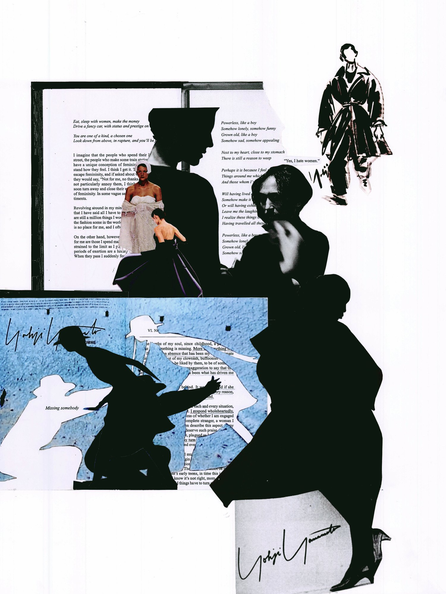

Powerless, like a boy  
Somehow lonely, somehow funny  
Grown old, like a boy  
Somehow sad, somehow appealing  
– My Dear Bomb by Yohji Yamamoto

The juxtaposition, proportion, and elimination of this collage are all intuitively manipulated to visually represent the source – Yohji Yamamoto’s book My Dear Bomb and his design philosophy.

