## Objective

At the start of the pandemic, I left New York City and moved in to my brother's apartment in Orlando. When I got there, I was shocked to find his spacious living room covered in cardboard boxes due to his complex's insufficient recycling service.

At the same time, I needed a place to study and make projects for online classes. And I thought, why not use all this "waste" that is readily available! So, I repurposed all these cardboard boxes and built a fully functioning table that got me through an entire semester of online classes.

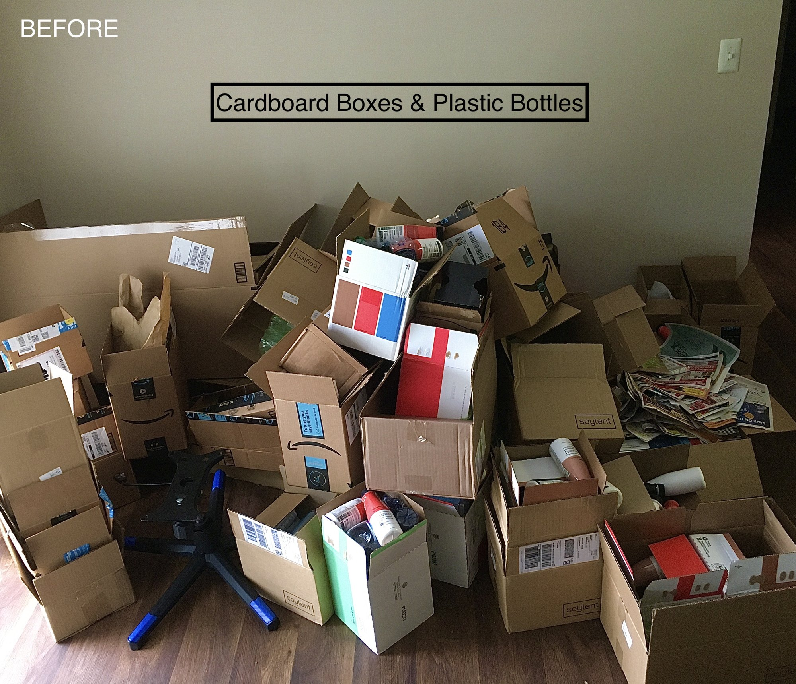

## Process

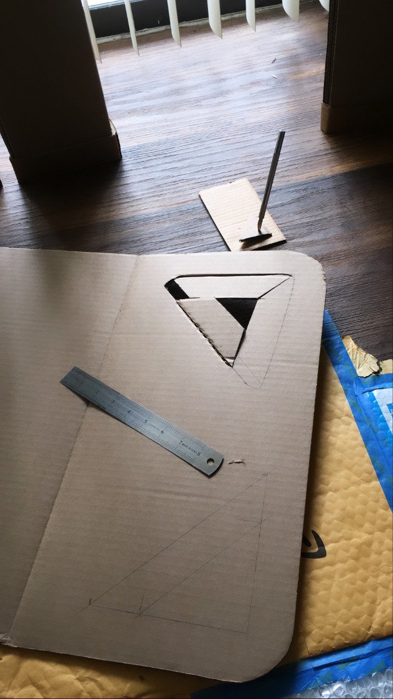
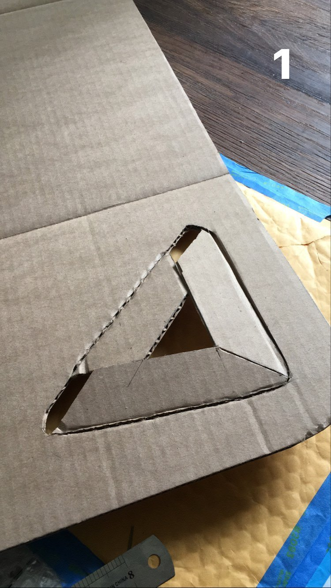
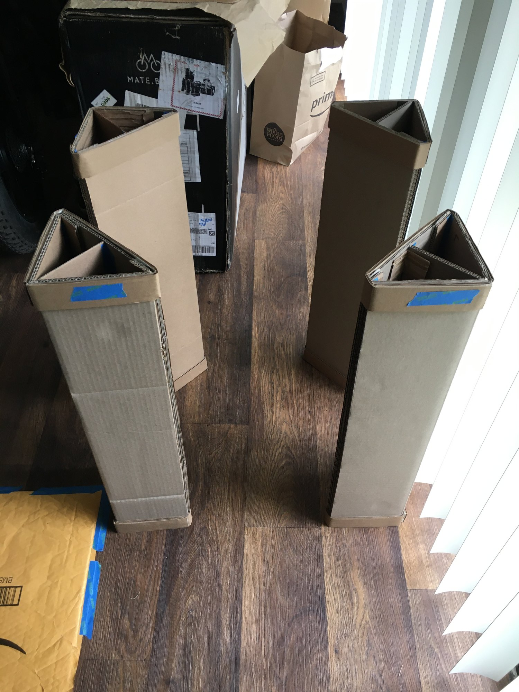
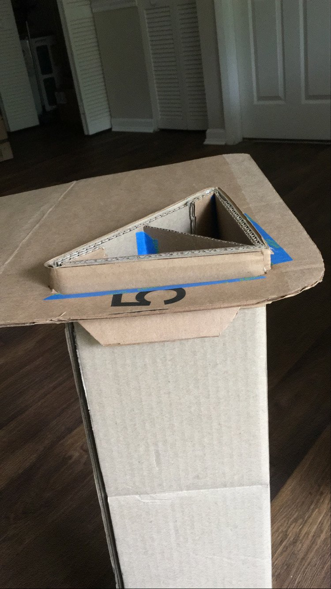
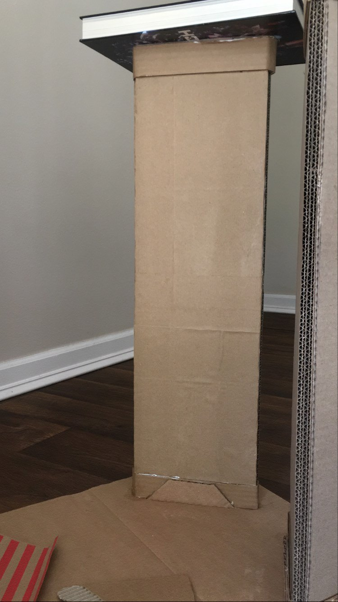
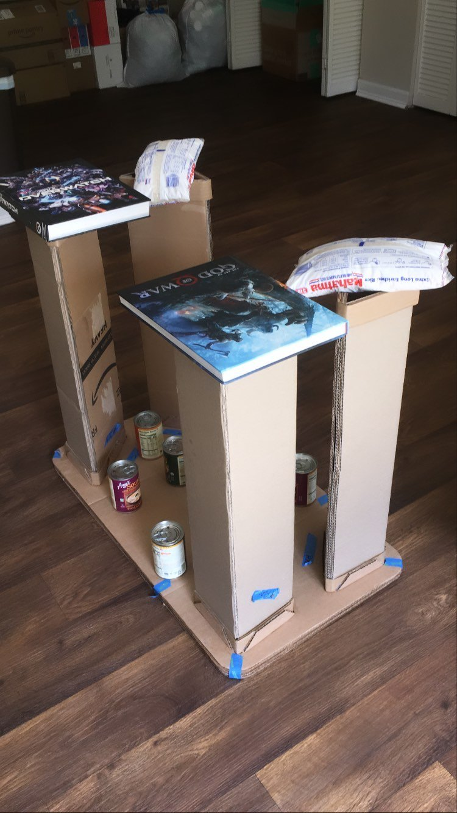

## Final table

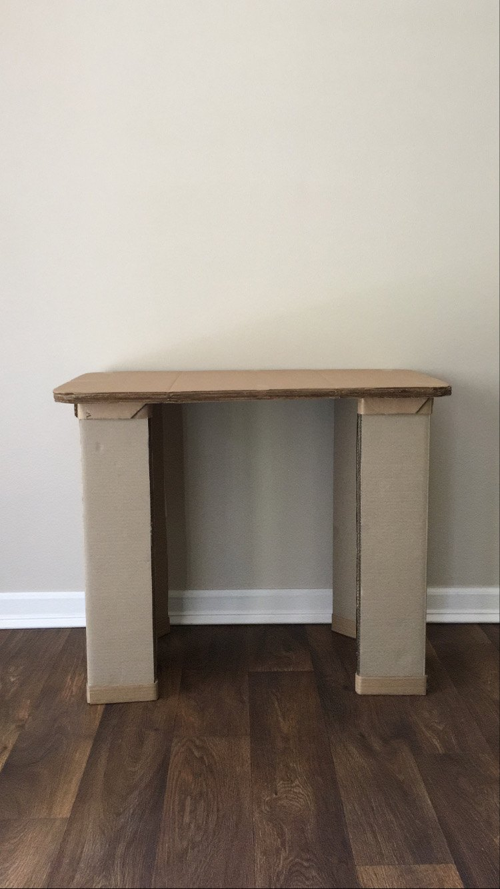
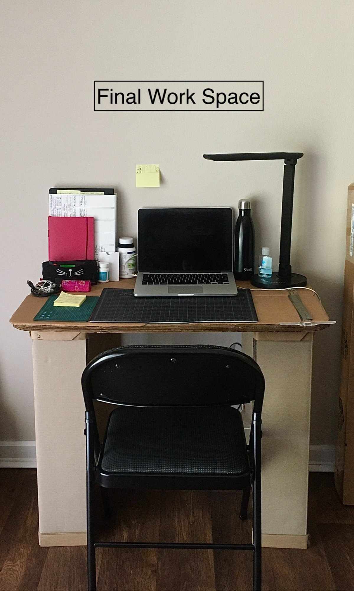
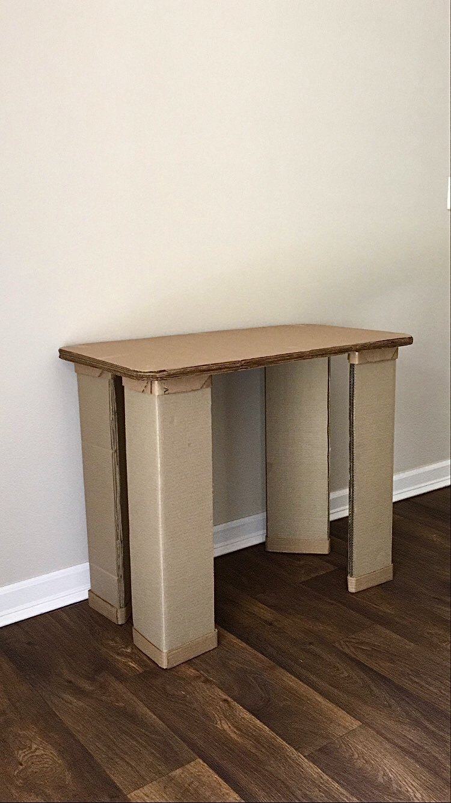

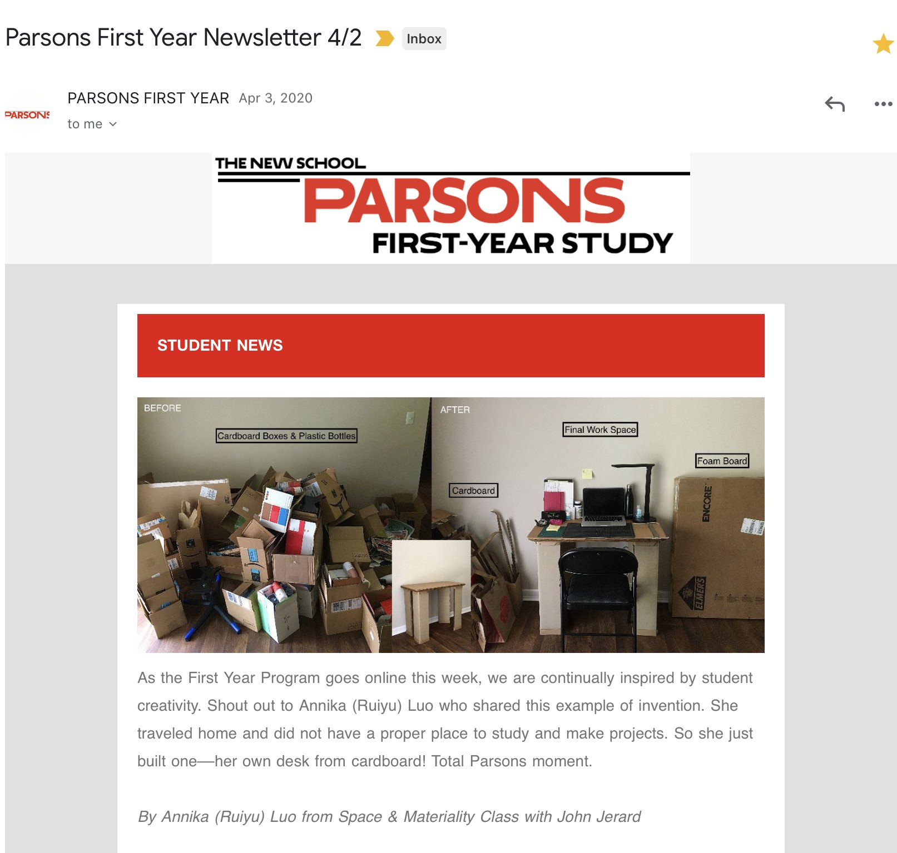

*Featured in the Parsons First Year Newsletter on April 2, 2020*
