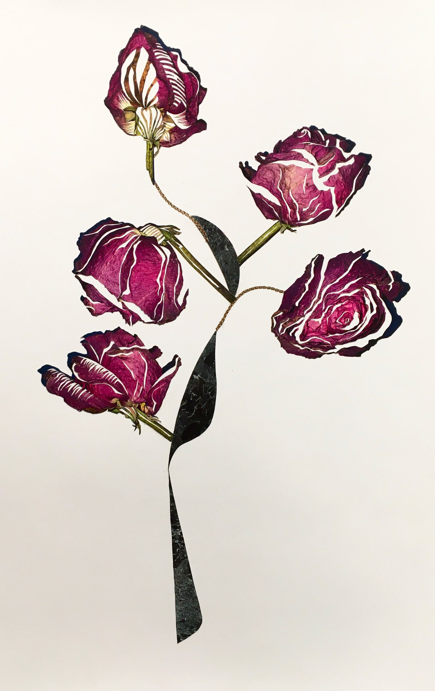

I have an innate fascination for flowers, especially dried ones. I want to shed light on objects that are often taken for granted – wrinkly dried roses.

Fresh roses are dried, photographed, retouched in Photoshop, and printed on heavy glossy paper, then curved out for collage.

