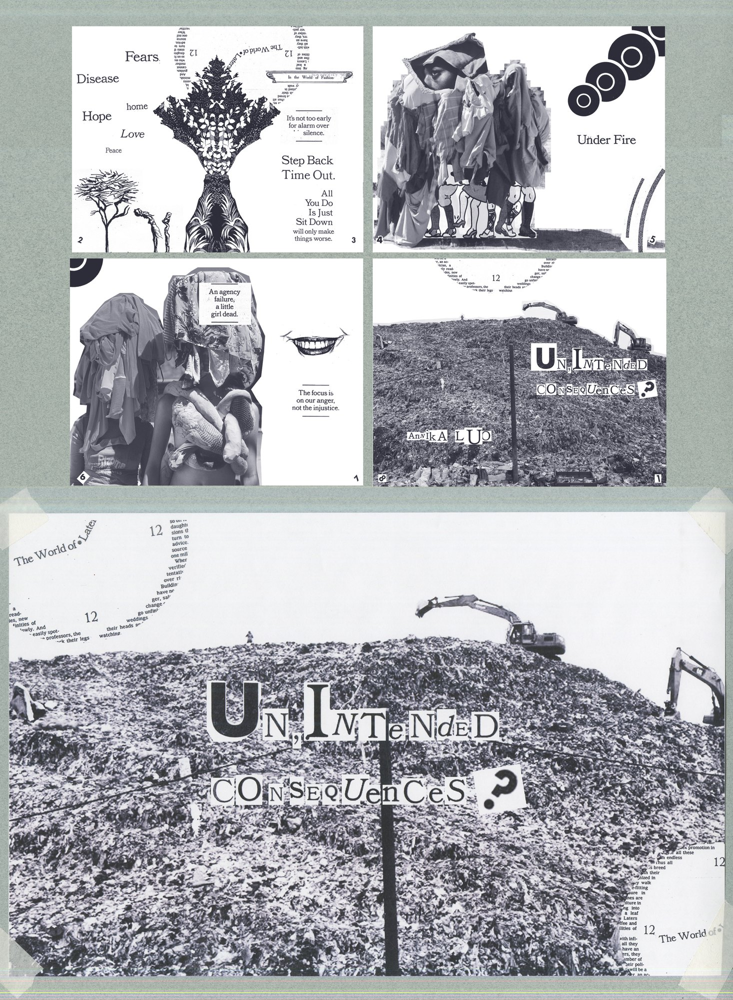
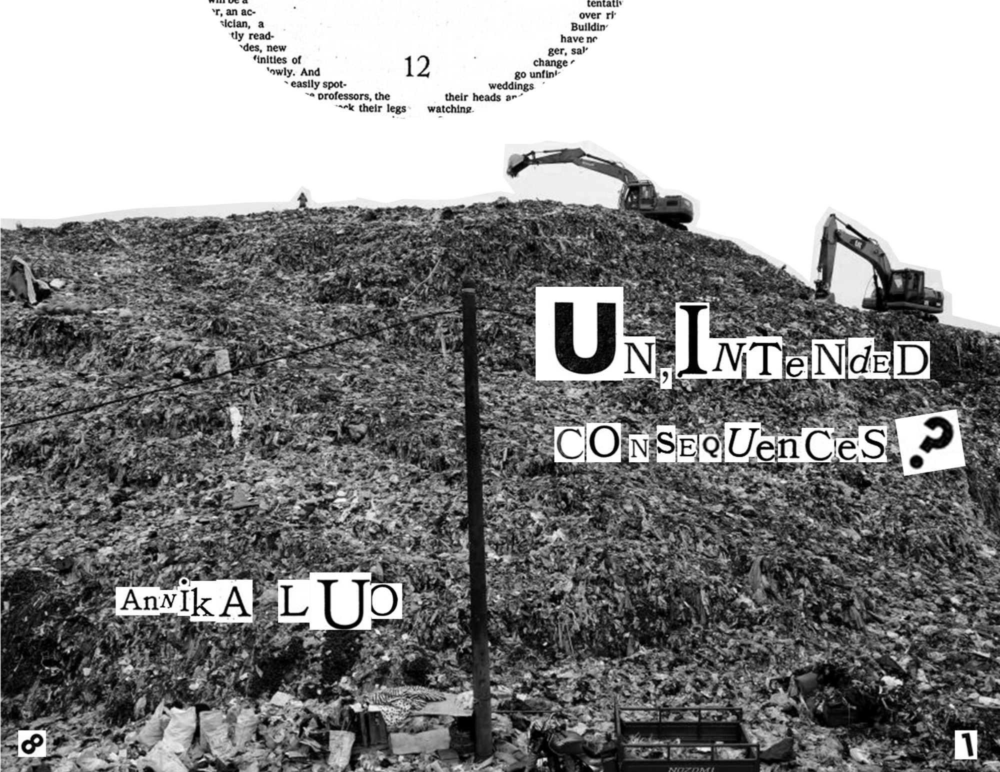
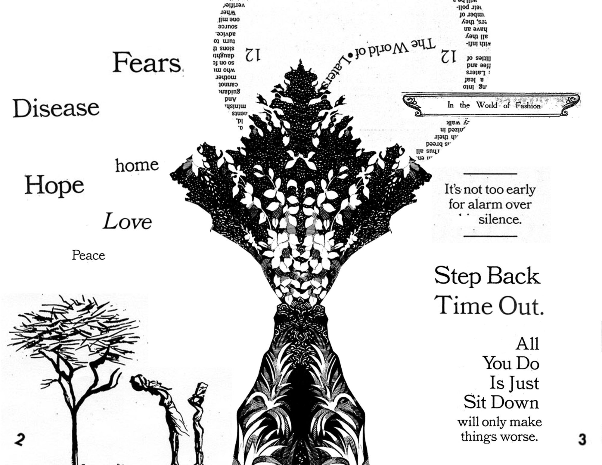
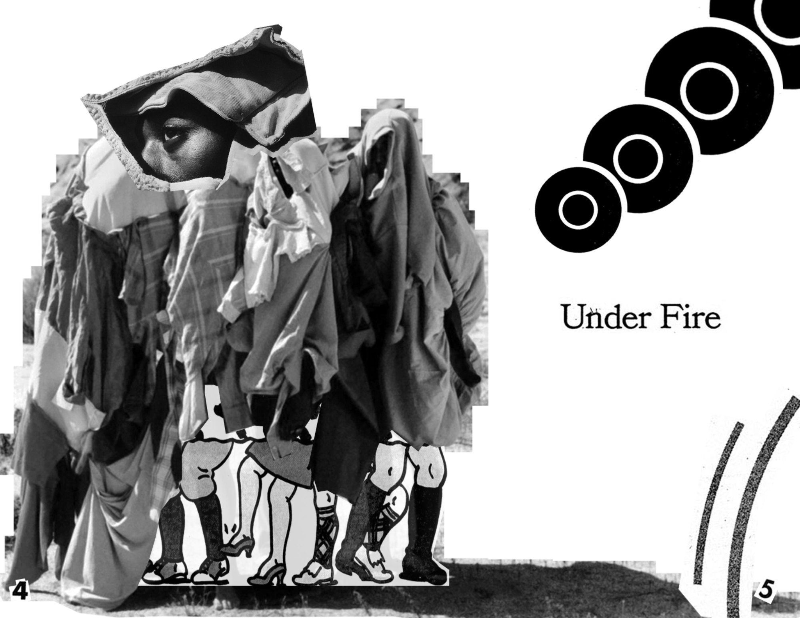
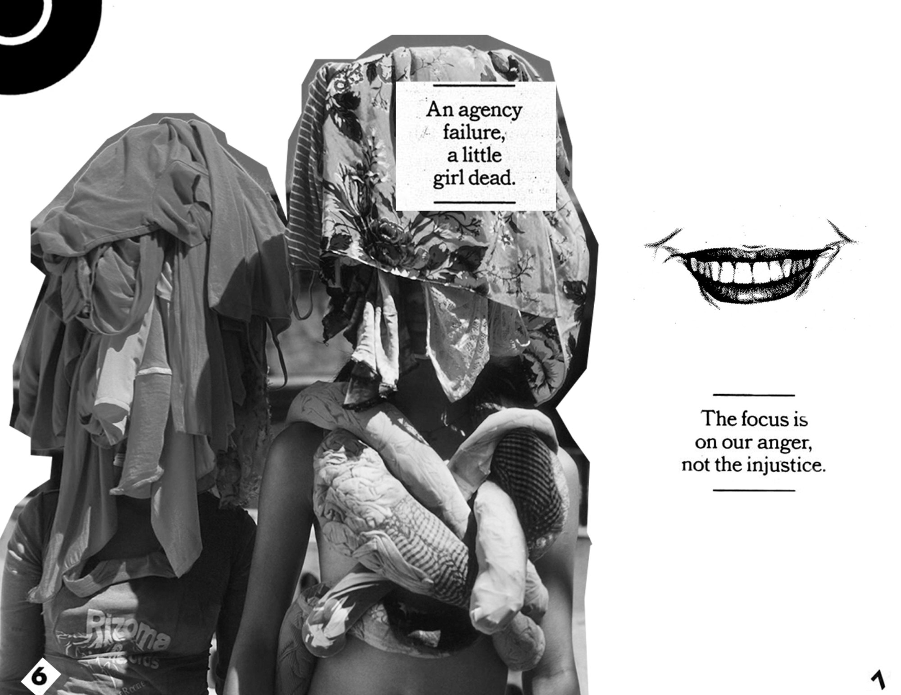

This collage incorporates components such as textile waste, The New York Times Magazine archive issues related to climate change and environmental degradation, and Rachel Carson. I carefully selected and arranged various prose, phrases, letters, and words to create a meaningful message that questions our ecological challenges. This 8-fold zine prompts us to consider whether these issues result from our unintentional actions.

## Zine

